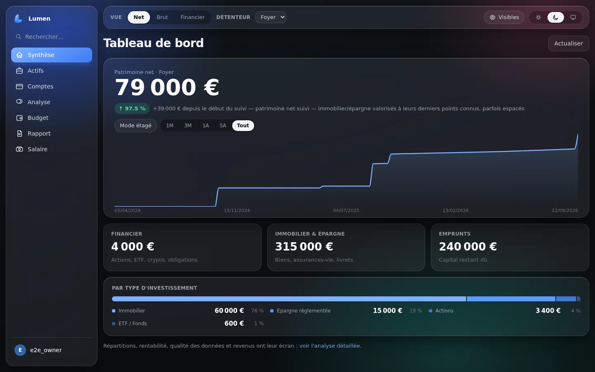
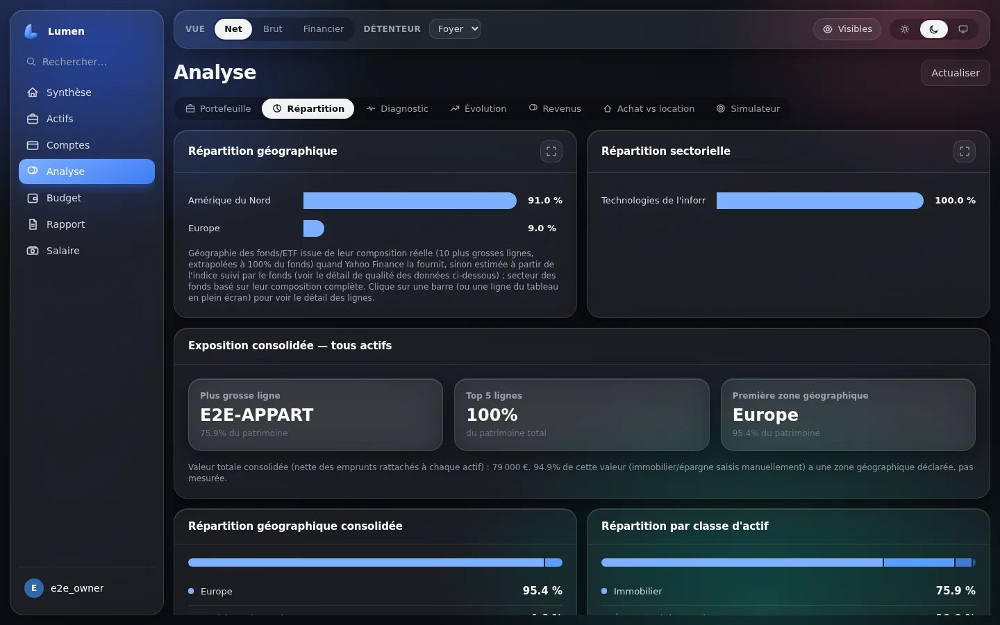
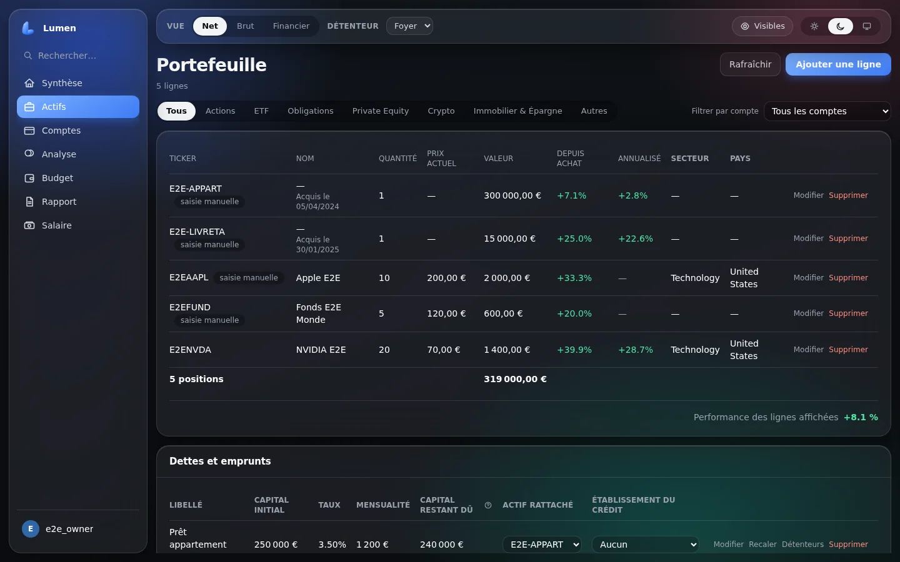
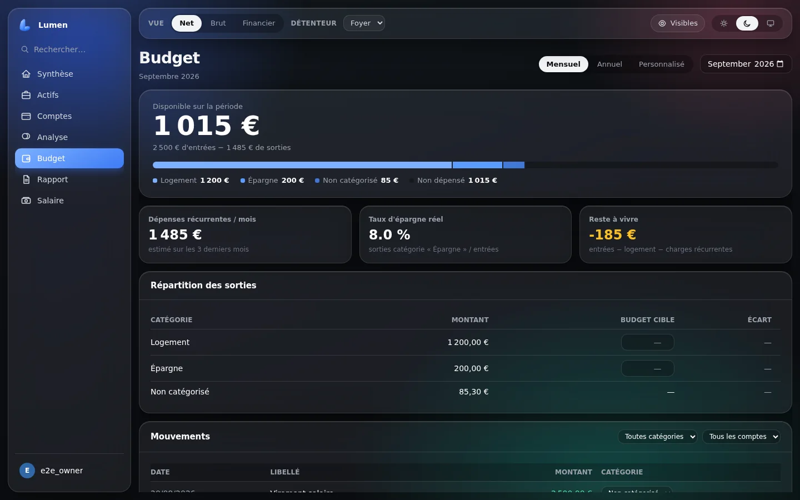
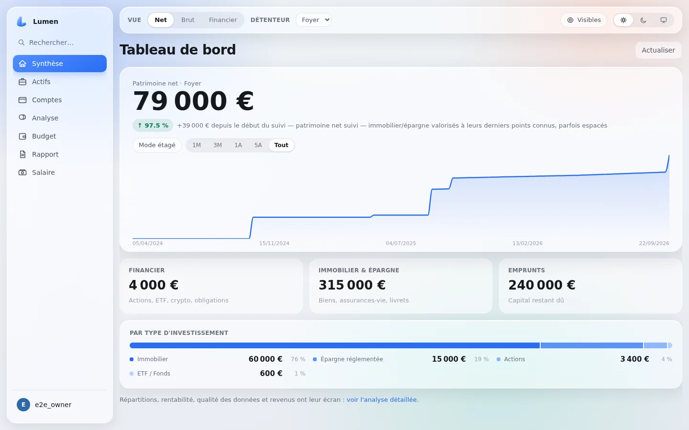

<div align="center">


# Lumen

**Faites la lumière sur vos finances.**

Suivi de patrimoine complet, auto-hébergé, gratuit et open source.<br>
Vos données restent sur votre machine.

[](https://github.com/Nello10110/lumen/actions/workflows/ci.yml)
[](https://github.com/Nello10110/lumen/pkgs/container/lumen-backend)
[](backend/)
[](frontend/)

[Installation](#installation) · [Fonctionnalités](#ce-que-lumen-sait-faire) · [Documentation](#documentation) · [Vos données](#vos-données-restent-chez-vous)

</div>

<br>



<br>

## Pourquoi Lumen

> **Voir tout ce que je possède et tout ce que je dois, savoir si ça monte, et comprendre pourquoi —
> sans envoyer mes données à personne, et sans payer.**

Les agrégateurs de patrimoine du marché demandent un abonnement annuel, hébergent vos avoirs sur
leur cloud, et présentent des scores dont la méthode n'est pas publique. Lumen prend le problème par
l'autre bout : l'application tourne **chez vous**, le code est lisible, et chaque calcul est
documenté — y compris ses limites.

Trois partis pris structurent tout le reste :

**Vos données ne partent pas.** Aucun compte à créer chez un tiers, aucune connexion bancaire
déléguée à un prestataire. Les seules requêtes qui sortent vont chercher des **cours de bourse**
(Yahoo Finance, justETF, CoinGecko) — jamais vos positions, jamais vos montants.

**Pas de synchronisation bancaire, donc pas ses pannes.** Vous importez un export de votre courtier
ou de votre banque ; Lumen reconstruit tout le portefeuille à partir de ce grand livre — quantités,
prix de revient, plus-values réalisées. Un ré-import du même fichier met à jour au lieu d'empiler.

**Le calcul se montre.** Quand la répartition géographique d'un ETF est *mesurée* (composition
réelle du fonds), l'écran le dit. Quand elle est *estimée* à partir de l'indice suivi, il le dit
aussi. Un chiffre dont on ignore la provenance ne vaut rien.

<br>

## Ce que Lumen sait faire

<table>
<tr>
<td width="50%" valign="top">

**Patrimoine complet**

Actions, ETF, obligations, crypto, private equity — mais aussi immobilier locatif, SCPI,
assurance-vie, PER, livrets, comptes courants et **dettes**. Le patrimoine net, pas seulement le
portefeuille boursier.

</td>
<td width="50%" valign="top">

**Reconstruction automatique**

Import d'un historique de transactions (Trade Republic et compatibles), d'un export Ledger, d'un
export Bricks.co, ou d'un relevé de positions de n'importe quel courtier via association manuelle
des colonnes.

</td>
</tr>
<tr>
<td width="50%" valign="top">

**Analyse en profondeur**

Répartition géographique et sectorielle avec transparence des fonds (*look-through*), rentabilité
réelle (XIRR), performance par période, comparaison à un indice de référence, coût de gestion
consolidé, score patrimonial expliqué.

</td>
<td width="50%" valign="top">

**Projection et revenus**

Calendrier des dividendes, revenus passifs projetés, simulateur d'intérêts composés, calcul
d'indépendance financière (FIRE), simulateur achat contre location.

</td>
</tr>
<tr>
<td width="50%" valign="top">

**Budget**

Import de relevés bancaires (OFX, QIF, CSV), catégorisation par règles, détection des dépenses
récurrentes, budget cible par catégorie — sans catégorisation par IA, délibérément.

</td>
<td width="50%" valign="top">

**Foyer et partage**

Plusieurs comptes (propriétaire, membre, invité), répartition des actifs entre détenteurs, liens de
partage publics protégés par code, journal d'accès, connexion SSO/OIDC facultative.

</td>
</tr>
<tr>
<td width="50%" valign="top">

**Documents**

Relevé de patrimoine PDF, déclaration de patrimoine pour un dossier de prêt, rapport périodique,
bilan annuel, export CSV, sauvegardes chiffrées planifiables.

</td>
<td width="50%" valign="top">

**Confort**

Application installable (PWA) sur téléphone et bureau, thème clair et sombre, masquage des montants,
recherche globale, mode « langage simple », rafraîchissement des cours planifiable.

</td>
</tr>
</table>

<br>

<table>
<tr>
<td width="50%"></td>
<td width="50%"></td>
</tr>
<tr>
<td width="50%"></td>
<td width="50%"></td>
</tr>
</table>

<div align="center"><sub>Captures prises sur un jeu de données de démonstration. Thème sombre et thème clair, au choix.</sub></div>

<br>

## Installation

### Avec Docker — la voie recommandée

Les images sont construites par la CI à chaque livraison et publiées publiquement : rien à compiler,
aucun compte à créer.

```bash
# 1. Récupérer le compose et le gabarit de configuration
curl -O https://raw.githubusercontent.com/Nello10110/lumen/main/compose-homelab.yaml
curl -o .env https://raw.githubusercontent.com/Nello10110/lumen/main/.env.exemple

# 2. Générer la clé qui chiffrera les sauvegardes, et la poser dans .env
openssl rand -base64 48
#    -> coller la valeur derrière PATRIMOINE_BACKUP_KEY= dans .env

# 3. Démarrer
docker compose -f compose-homelab.yaml up -d
```

L'application est sur **http://localhost:8080**. Le premier compte créé devient propriétaire du
foyer ; l'inscription se referme ensuite d'elle-même.

> **Conservez `PATRIMOINE_BACKUP_KEY`** aussi précieusement que vos données : la changer rend
> illisibles toutes les sauvegardes chiffrées déjà produites.

> Ce compose publie les ports sur `0.0.0.0` — l'application est donc joignable depuis tout votre
> réseau local, ce qui est généralement l'intention. Elle reste injoignable depuis internet tant que
> votre box ne redirige pas ces ports. Pour un accès strictement local à la machine, utilisez
> [`compose-exemple.yaml`](compose-exemple.yaml), qui lie les ports à `127.0.0.1` et construit les
> images depuis les sources.

Les deux variables facultatives (connexion SSO/OIDC, clé CoinGecko pour les cours crypto) sont
documentées dans [`.env.exemple`](.env.exemple) et au [manuel d'exploitation](docs/MANUEL_EXPLOITATION.md).

### Depuis les sources — pour développer

```bash
# Backend : API FastAPI sur le port 8000
cd backend
python -m venv venv
. venv/bin/activate          # Windows : venv\Scripts\activate
pip install -r requirements-dev.txt
python -m uvicorn app.main:app --port 8000

# Frontend : Vite sur le port 5173
cd frontend
npm install
npm run dev
```

L'interface est alors sur **http://localhost:5173** ; le serveur de développement relaie `/api` vers
le backend. Aucune base à créer : le schéma est posé automatiquement au démarrage (Alembic).

<br>

## Premiers pas

1. **Créez votre compte.** Le premier inscrit devient propriétaire du foyer. Un assistant de
   bienvenue propose ensuite de déclarer les détenteurs, les établissements et les comptes.
2. **Importez votre portefeuille.** Écran *Import* : déposez l'export de votre courtier sur la tuile
   correspondante. Un aperçu s'affiche avant toute écriture — rien n'est importé sans confirmation.
3. **Complétez le patrimoine.** Écran *Actifs* : ajoutez à la main ce qu'aucun courtier n'exporte —
   immobilier, livrets, assurance-vie, prêts en cours.
4. **Explorez.** L'écran *Analyse* regroupe répartition, diagnostic, évolution, revenus et
   simulateurs.

Chaque écran est détaillé dans le [manuel utilisateur](docs/MANUEL_UTILISATEUR.md).

<br>

## Vos données restent chez vous

| | |
|---|---|
| **Stockage** | Un fichier SQLite, sur votre machine. Rien ailleurs. |
| **Ce qui sort** | Uniquement des requêtes de cotation : un symbole boursier part, un cours revient. Vos quantités et vos montants ne sont jamais transmis. |
| **Comptes bancaires** | Aucune connexion déléguée, aucun agrégateur tiers, aucun identifiant bancaire demandé. |
| **Sauvegardes** | Chiffrées avec votre propre clé (Fernet / PBKDF2-HMAC-SHA256, 600 000 itérations), planifiables, restaurables. |
| **Export** | Vos données vous appartiennent et ressortent en CSV ou en archive complète, à tout moment. |
| **Exposition** | Aucun port ouvert sur internet par défaut. Authentification obligatoire, journal d'accès, verrouillage après tentatives échouées, SSO/OIDC en option. |

<br>

## Documentation

| Document | Pour qui |
|---|---|
| [Manuel utilisateur](docs/MANUEL_UTILISATEUR.md) | Mode d'emploi de chaque écran |
| [Manuel d'exploitation](docs/MANUEL_EXPLOITATION.md) | Architecture, déploiement, sauvegarde, SSO, dépannage |
| [Spécifications fonctionnelles](docs/SPECIFICATIONS_FONCTIONNELLES.md) | Périmètre, règles métier, modèle de données |
| [Expression de besoin](docs/EXPRESSION_DE_BESOIN.md) | Contexte, exigences, critères d'acceptation |
| [Backlog](docs/BACKLOG.md) | Journal des décisions et des arbitrages, évolutions envisagées |

<br>

## Sous le capot

**Backend** — Python, FastAPI, SQLAlchemy 2.0, SQLite, Alembic, APScheduler, `yfinance`
**Frontend** — React, TypeScript, Vite, Tailwind CSS, Recharts

Le code et la documentation sont **en français**, commentaires compris : ce projet est lu autant
qu'il est écrit, et les décisions y sont expliquées là où elles s'appliquent plutôt que dans un
historique qu'on ne relit jamais.

```bash
# Backend
cd backend && pip install -r requirements-dev.txt
python -m pytest -q            # tests
python -m ruff check app/ scripts/

# Frontend
cd frontend && npm install
npm run test                   # vitest
npm run lint                   # oxlint
npm run build                  # inclut la vérification des types (tsc)

# Bout en bout : vrai navigateur, vrai backend, base jetable
npx playwright install --with-deps chromium   # une seule fois
npm run test:e2e
```

Ces cinq vérifications tournent aussi sur chaque push et chaque pull request
([`ci.yml`](.github/workflows/ci.yml)). La suite de bout en bout démarre elle-même un backend dédié
sur une base jetable — jamais la vôtre.

<br>

## Contribuer

Les retours, rapports de bogue et propositions sont les bienvenus via les
[issues](https://github.com/Nello10110/lumen/issues). Avant une pull request, faites tourner les
vérifications ci-dessus : la CI les rejouera de toute façon.

<br>

<div align="center">
<sub>Lumen n'est affilié à aucun courtier, aucune banque et aucun agrégateur.<br>
Il ne fournit aucun conseil en investissement.</sub>
</div>
